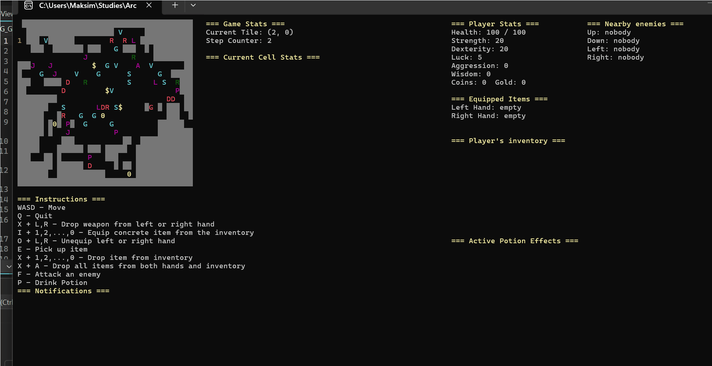

# Roguelike Game — Design Patterns & Architecture


An academic C# console-based Roguelike RPG game focused on exploring, implementing, and combining Gang of Four (GoF) object-oriented software design patterns and clean architectural practices.

This is a desktop console application. To run and interact with the game, clone the repository to your local machine, build the solution, and run it locally.

---

## Demonstration



---

## Game Overview

The game features a player exploring a dungeon grid. The player can move in 4 directions (Up, Down, Left, Right).

The dungeon consists of walls and cells. Each cell can contain numerous different items and entities:
- **Weapons**: Used by the player to fight enemies.
- **Potions**: Can be drunk by the player to boost their stats.
- **Unusable Items**: Placed for decoration throughout the dungeon.
- **Currency**: Collected to increase player wealth.
- **Enemies**: Aggressive entities that try to kill the player.

### Details
- **3 Different Weapons**: Gun, Sword, and Verbal Abuse across 3 categories (Magic, Light, and Heavy), classified as either 1-handed or 2-handed.
- **3 Weapon Decorators**: Powerful, Aggressive, and Unlucky modifiers that boost base weapon stats.
- **4 Different Potions**: Boost player stats with either eternal (permanent) or temporal (temporary for a certain number of moves) effects.
- **3 Different Enemies**: Rats, Goblins, and Dragons with distinct combat stats and behavior strategies.
- **2 Currency Types**: Coins and Gold.
- **3 Unusable Items**: Decorative items found across dungeon cells.

Players can pick any item from the dungeon floor into their "backpack" (inventory), equip one of their hands (or both) with a weapon, drink a potion, drop any item from the inventory, or fight a nearby enemy.

---

## Software Architecture & Design Patterns

The project's primary focus is demonstrating object-oriented design principles and GoF design patterns in a game engine context.

| Design Pattern | Location | Purpose & Application |
| :--- | :--- | :--- |
| **MVC** | [`MVC_Pattern/`](RPG_Game/RPG_Game/MVC_Pattern) | Decouples domain entities, UI view rendering, and game loop execution, laying clean groundwork for potential network multiplayer expansion. |
| **Decorator** | [`Decorators/`](RPG_Game/RPG_Game/Decorators) | Dynamically wraps weapon objects at runtime with stat-boosting traits (`Powerful`, `Aggressive`, `Unlucky`) without class inheritance explosion. |
| **Builder & Director** | [`Builders/`](RPG_Game/RPG_Game/Builders), [`Director.cs`](RPG_Game/RPG_Game/Director.cs) | Simplifies multi-step generation of custom dungeon levels (e.g., levels without enemies, levels without potions, custom room structures). |
| **Singleton** | [`ConsoleView.cs`](RPG_Game/RPG_Game/MVC_Pattern/View/ConsoleView.cs) | Enforces a single global View instance to prevent duplicate rendering contexts and invalid references across input handlers. |
| **Chain of Responsibility** | [`InputHandlers/`](RPG_Game/RPG_Game/InputHandlers) | Passes raw console keypress events through a decoupled chain of input command handlers until an active handler consumes the input. |
| **Visitor** | [`AttackVisitors/`](RPG_Game/RPG_Game/AttackVisitors), [`DefenseVisitors/`](RPG_Game/RPG_Game/DefenseVisitors) | Uses double dispatch for attack and defense interactions (`Normal`, `Magic`, `Stealth`), resolving complex many-to-many combat relationships cleanly. |
| **Strategy** | [`Strategies/`](RPG_Game/RPG_Game/Strategies) | Encapsulates enemy reaction and movement AI behaviors into interchangeable strategy objects for runtime state transitions. |

---

## Requirements & Setup

### Prerequisites
* **.NET 8.0 SDK** or higher
* **Visual Studio 2022** (or any compatible C# IDE)
* **Windows OS** (recommended terminal resolution: $160 \times 60$ grid or zoom out using `Ctrl` + `-`)

### Building and Running Locally

1. **Clone the repository**:
   ```bash
   git clone https://github.com/uasuna2022/Roguelike-Game.git
   cd Roguelike-Game
   ```

2. **Open Solution**:
   Open `RPG_Game/RPG_Game.sln` in Visual Studio.

3. **Build & Run**:
   * Build the solution (`Ctrl` + `Shift` + `B`).
   * Run the application (`F5` or `dotnet run --project RPG_Game/RPG_Game/RPG_Game.csproj`).
